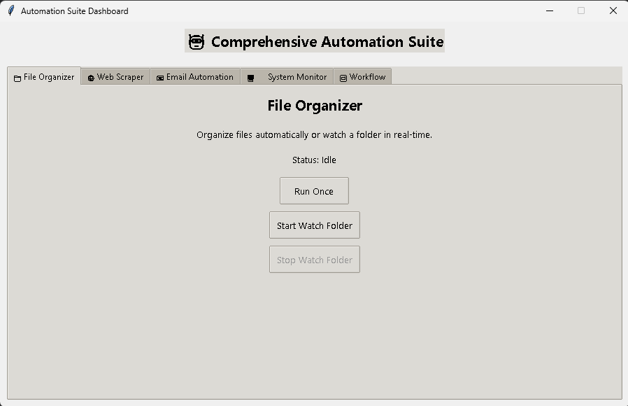
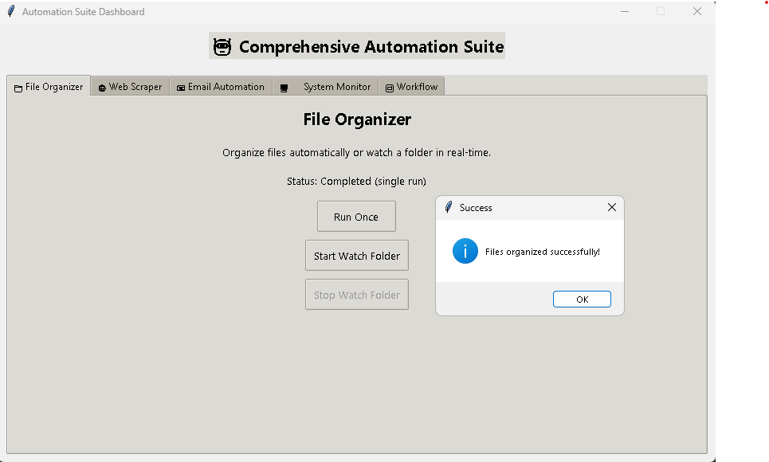
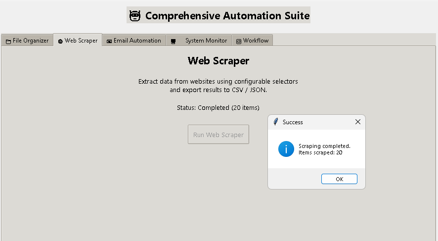
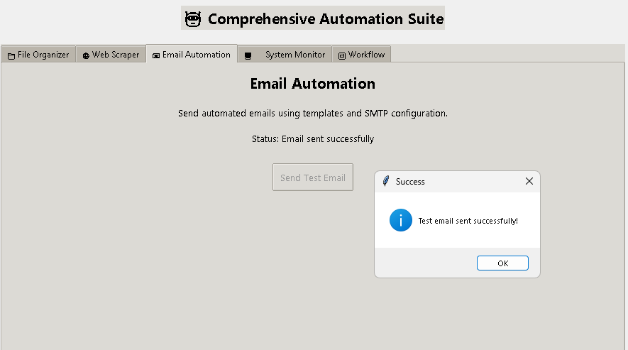
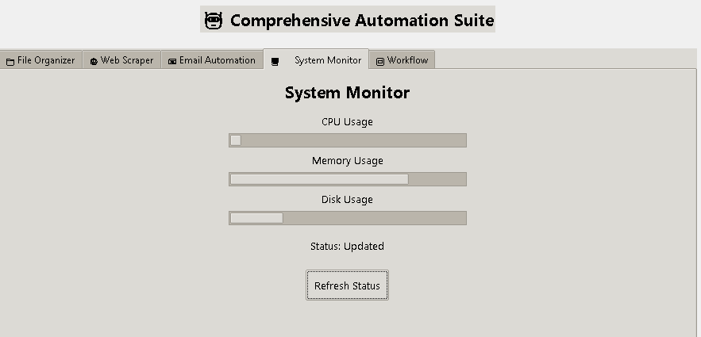
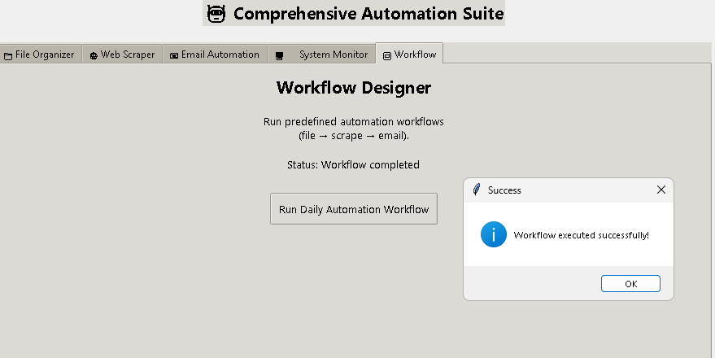

# 🤖 Comprehensive Automation Suite (Python)

A **full-featured Python automation platform** that integrates multiple real-world automation tools into a **single desktop application with GUI and workflow support**.

This project demonstrates **system automation, web scraping, email automation, system monitoring, scheduling, and workflow orchestration**, built using clean architecture and industry best practices.


## 📌 Project Highlights

* 🔹 Modular, scalable automation architecture
* 🔹 GUI-based desktop application (Tkinter)
* 🔹 Config-driven (no hardcoding)
* 🔹 Workflow engine for chaining tasks
* 🔹 Logging, error handling, and reporting
* 🔹 Resume & interview-ready project

### Dashboard


## 🧠 Automation Modules Overview

### 📁 File Organizer 

* Automatically organizes files by type
* Duplicate file handling
* Real-time folder monitoring (watch mode)
* Start / Stop watcher via GUI
* Configurable source & destination folders




### 🌐 Web Scraper 

* Scrapes multiple URLs
* User-Agent rotation
* Retry & rate limiting
* CSS selector-based extraction
* CSV & JSON export
* Ethical scraping practices followed





### 📧 Email Automation 

* SMTP-based email sending
* Text & HTML templates
* Dynamic template variables
* Email scheduler (daily / weekly)
* Attachment support (CSV, JSON, logs)





### 🖥️ System Monitor

* CPU, Memory, Disk monitoring
* Threshold-based alerts
* Alert cooldown (anti-spam)
* Monitoring history (JSON reports)
* Automated email alerts





### 🔁 Workflow Designer

* JSON-based workflow definitions
* Chain multiple automation tasks
* GUI-triggered workflow execution
* Error-safe execution with logging

Example Workflow:

```
File Organizer → Web Scraper → Email Report
```




## 🖥️ GUI Dashboard (Week 5)

* Built using **Tkinter + ttk**
* Modern styled tabs
* Status indicators & progress bars
* Background threading (no UI freeze)
* Centralized control for all automation modules


## 🗂️ Project Structure

```
automation_suite/
│
├── main.py
├── requirements.txt
├── README.md
│
├── config/
│   ├── config.json
│   ├── web_scraper.json
│   ├── email_config.json
│   └── system_monitor.json
│
├── modules/
│   ├── file_organizer/
│   ├── web_scraper/
│   ├── email_automation/
│   └── system_monitor/
│
├── workflow/
│   ├── engine.py
│   └── workflows.json
│
├── gui/
│   ├── app.py
│   ├── file_tab.py
│   ├── scraper_tab.py
│   ├── email_tab.py
│   ├── monitor_tab.py
│   └── workflow_tab.py
│
├── templates/
│   └── email/
│
├── data/
├── reports/
├── logs/
└── utils/
```


## ⚙️ Installation & Setup

### 1️⃣ Clone Repository

```bash
git clone https://github.com/cyberfortify/automation-suite.git
cd automation-suite
```

### 2️⃣ Create Virtual Environment

```bash
python -m venv venv
```

Activate:

```bash
# Windows
venv\Scripts\activate

# Mac/Linux
source venv/bin/activate
```

### 3️⃣ Install Dependencies

```bash
pip install -r requirements.txt
```


## 🔐 Configuration Files

### `config/config.json`

* File organizer settings
* Logging configuration

### `config/web_scraper.json`

* URLs
* CSS selectors
* Retry & delay
* Export format

### `config/email_config.json`

* SMTP server
* Sender email
* App password
* Recipients list

### `config/system_monitor.json`

* Monitoring interval
* Thresholds
* Alert cooldown

⚠️ **Note:**
Use **App Passwords** for Gmail SMTP (recommended).


## ▶️ Running the Application

### Start GUI Dashboard

```bash
python main.py
```

### Available GUI Tabs

* File Organizer
* Web Scraper
* Email Automation
* System Monitor
* Workflow Designer


## 🔁 Workflow Example

### `workflow/workflows.json`

```json
{
  "daily_automation": {
    "description": "Daily automation workflow",
    "steps": [
      { "task": "file_organizer" },
      { "task": "web_scraper" },
      { "task": "send_email", "subject": "Daily Automation Report" }
    ]
  }
}
```

Run directly from GUI → **Workflow Tab**


## 🧪 Testing & Validation

* File organizer tested with real folders
* Web scraper tested on public practice sites
* Email system tested with SMTP & attachments
* Monitoring verified with live system metrics
* Workflow execution validated end-to-end


## 📊 Sample Output

* Organized files into category folders
* Scraped data exported to CSV / JSON
* Email reports delivered automatically
* System metrics logged & reported
* Workflow executed without manual intervention


## ⚖️ Ethical & Security Considerations

* No scraping of private or authenticated content
* Respectful request delays
* Credentials stored in config files
* No hardcoded secrets in code
* Alert cooldown to prevent email spam


## 🎯 Skills Demonstrated

* Python Automation & Scripting
* Modular Software Design
* Web Scraping (BeautifulSoup, Requests)
* SMTP & Email Automation
* System Monitoring (psutil)
* GUI Development (Tkinter)
* Workflow Orchestration
* Logging & Error Handling
* Config-Driven Architecture


## 📌 Future Enhancements

* Drag-and-drop workflow builder
* Background service deployment
* Advanced scheduling (cron integration)
* Database-backed monitoring history
* Dark mode UI


## 📄 License

This project is for **educational and portfolio purposes**.


## 🙌 Acknowledgements

* Python community
* Open-source libraries
* Automation best practices


🔥 **Month 4 Automation Suite Project – Completed Successfully**
If you’re reviewing this project, feel free to explore each module independently or run workflows via the GUI.
